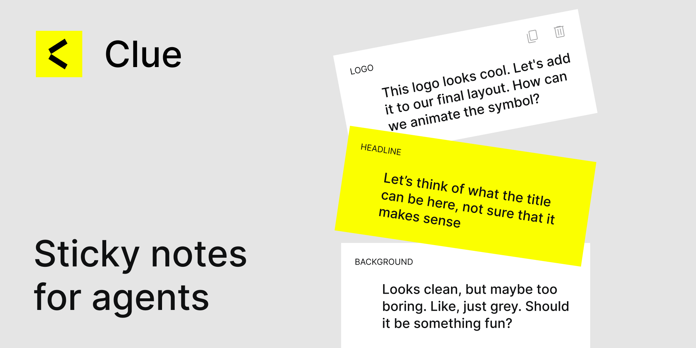

# Clue



**Sticky notes for AI agents in Figma. Because without them, they have no clue.**

Clue is a two-part system for bridging Figma and AI coding agents:

1. **[Clue Figma plugin](https://www.figma.com/community/plugin/1626398221121985554)** — designers leave inline sticky notes on any frame or section.
2. **Clue Claude Code skill** — this repo. Lets your agent find those notes, understand each one in context, and report back in chat about what they mean.

## Why Clue exists

Your AI coding agent opens your Figma file and has no clue what's going on. It's staring down 400 frames, 12 component variants, and a page called `wip-final-FINAL-v3`. It guesses. It copies the wrong spacing. It misses the "empty state" frame entirely. It rebuilds the button from scratch because it couldn't see the note you left on the master component.

Clue fixes that. You leave a note on the frame — an edit request, a build-time hint for when you're generating code, a brainstorm prompt, a change log, or just hidden context — and your agent reads it, looks at the surrounding screen, figures out what you actually meant, and tells you in chat. Then you decide what to do next: apply it in Figma, build code from it, keep brainstorming, or just bank the context for later. Nobody re-explains the same thing four times.

## Requirements

You need all three of these installed and working together:

- A coding agent with tool access — [Claude Code](https://claude.com/claude-code), Codex CLI, Cursor, or any CLI/IDE agent that can call MCP servers and read skill folders.
- The [Figma MCP server](https://help.figma.com/hc/en-us/articles/32132100833559) — so your agent can query your Figma file, read nodes, and export assets.
- The [Clue Figma plugin](https://www.figma.com/community/plugin/1626398221121985554) — installed in your Figma workspace so you can leave notes in the first place.

Without the plugin, there are no notes. Without Figma MCP, your agent can't see your file. Without this skill, your agent won't know Clue exists. Install all three.

## Install

Clone this repo directly into your Claude Code skills folder:

```bash
git clone https://github.com/ryadovoys/clue-skill.git ~/.claude/skills/clue
```

That's it. Claude Code picks up the skill automatically the next time you start a session.

To update later:

```bash
cd ~/.claude/skills/clue && git pull
```

## How it works

1. **Leave clues in Figma.** Open the Clue plugin, select any frame or section, and type a note. It autosaves and stays pinned to that frame.
2. **Ask your agent to look at them.** Paste the Figma file URL and say something like:

   ```
   /clue https://figma.com/design/...
   address my clues in https://figma.com/design/...
   check figma notes in https://figma.com/design/...
   look at my figma notes
   ```

   The agent loads the Clue skill, scans the file via the Figma MCP server, and pulls every clue attached to the frames in scope.
3. **Your agent now has the context you have.** It groups clues by screen, screenshots the surrounding layout, interprets what each clue is asking for, and reports back in chat. From there you can apply them in Figma, build code from them, or keep brainstorming — your call.

The scope follows the URL:
- URL with a `node-id` → scans only that node's descendants.
- URL without a `node-id` → scans every page in the file.

## How clues are stored

Clues live as `sharedPluginData` on Figma nodes in the `clue` namespace. Each clue is a JSON blob on the `note` key:

```json
{ "text": "...", "createdAt": "ISO timestamp" }
```

The plugin reads and writes clues. The skill only reads them — it never writes back to a clue. Everything the agent has to say lives in chat.

## License

MIT. Use freely, fork gladly, no warranty.

---

Built by [Sergey Ryadovoy](https://www.ryadovoy.com/). Enjoying Clue? [Support the project ☕](https://buymeacoffee.com/ryadovoys)
